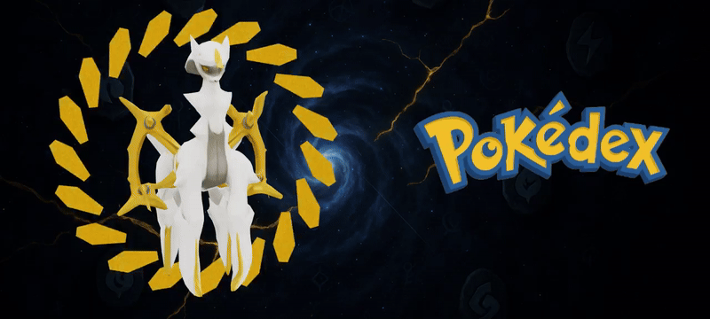
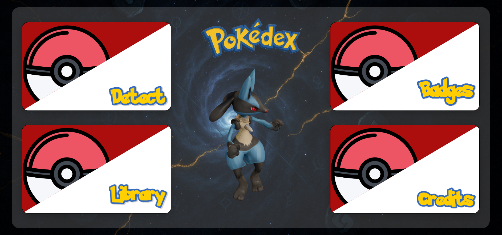
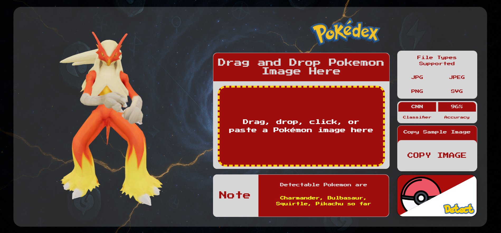
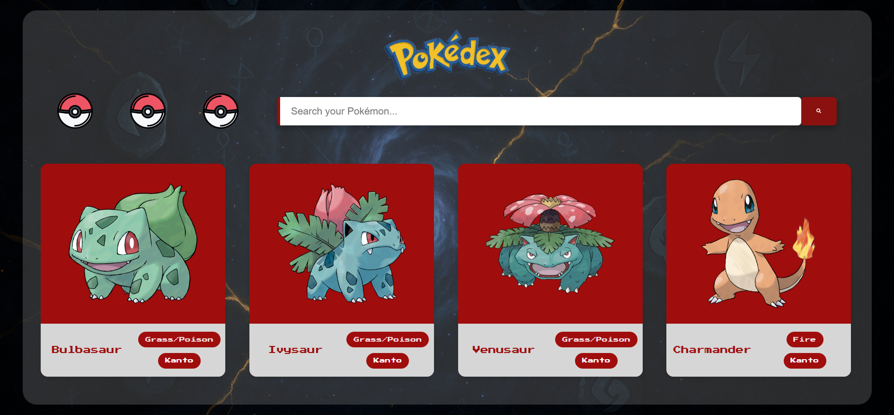
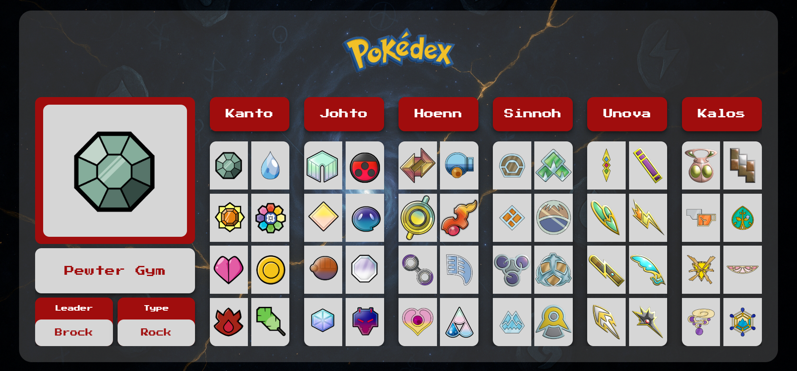
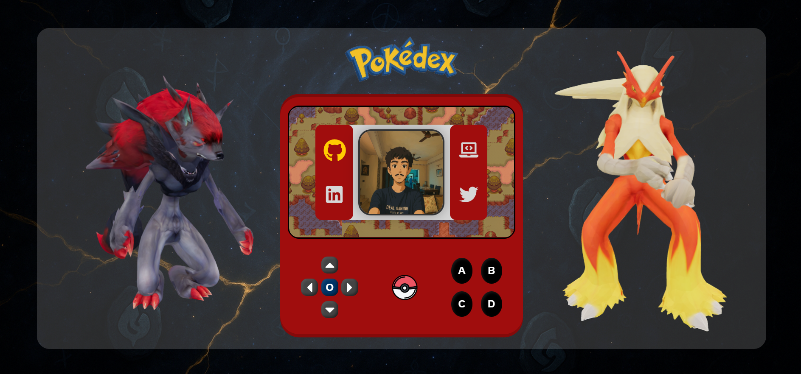

<!-- TITLE with Animated Typing Effect --> 
  
 
  
 <h1 align="center" style="color:#F61C1C;">🔥 PokéDex:  React + TensorFlow CNN + Blender🔥</h1>
 

  

  

  
 

  
  
  
  
  
  

 
 

  

  
  

   

  

  

  

   
   

  <a href="https://pokedex-gamma-two.vercel.app" target="_blank" rel="noopener noreferrer" 
     style="text-decoration:none; font-weight:bold; font-size:2.5rem; color:#ffcb05;">
     <strong>LAUNCH THE POKÉDEX</strong> 
  </a>

  

  

<h2>🎮 What is Inside?</h2>

- AI-powered Pokémon prediction with <strong>96% accuracy</strong> using TensorFlow CNN
- 120+ custom 3D Pokémon models built in Blender 🎨
- Real-time data fetching from <a href="https://pokeapi.co/">PokéAPI</a>
- Interactive Gym Hub with leaders, badges, and trivia
- Fully responsive design — works on phones, tablets, and even your laptops!!

 
 

<h2>🎮 What is This?</h2>

  Welcome to <strong>your personal AI-powered, 3D-enhanced PokéDex</strong>, built from scratch to not just catalog Pokémon but to <em>understand</em> them. With a smart CNN model that guesses Pokémon with <strong>96% accuracy</strong>, interactive 3D models, and live API data fetching, this is the PokéDex you never knew you needed — until now. 🌟

 
 

<h2>🚀 The Legendary Tech Stack</h2>
 
<table aria-label="Technology stack table" align="center">
  <thead>
    <tr>
      <th>🔧 Technology</th>
      <th>⚔️ Role &amp; Magic</th>
    </tr>
  </thead>
  <tbody>
    <tr><td><strong>React + Vite</strong></td><td>Lightning-fast frontend ⚡ with modular, clean UI components</td></tr>
    <tr><td><strong>Vanilla CSS</strong></td><td>Crisp, responsive, and visually stunning styles 🎨</td></tr>
    <tr><td><strong>Flask</strong></td><td>The Python backend hero connecting AI &amp; frontend 🤖</td></tr>
    <tr><td><strong>TensorFlow (CNN)</strong></td><td>The AI brain that <em>predicts</em> Pokémon — boasting 96% accuracy 🧠</td></tr>
    <tr><td><strong>PokéAPI</strong></td><td>Live-fetching detailed sprites, stats, evolutions — too big for local storage! 📡</td></tr>
    <tr><td><strong>Custom JSON Files</strong></td><td>Local storage of crucial Pokémon data for instant loading ⚡</td></tr>
    <tr><td><strong>Blender 3D Models</strong></td><td>Over <strong>120</strong> fully interactive 3D Pokémon models rendered in-browser! 🎥</td></tr>
    <tr><td><strong>Animations &amp; Effects</strong></td><td>Smooth transitions, hover glows, and spinning Pokéballs everywhere! ✨</td></tr>
  </tbody>
</table>

 
 

  
  
  
  
  
  

 

  Throwback to those endless hours with your Game Boy, catching, trading, and battling — this project is a love letter to that magical childhood.

 
 
<h2>⚙️ Smart Data Handling: JSON &amp; API in Harmony</h2>

  To keep the app speedy without sacrificing depth: 
  <strong>- Local JSON Files</strong> store essential data (names, types, base stats) for <em>instant access</em> and quick UI response. 
  <strong>- PokéAPI</strong> handles the heavy lifting with sprites, evolution chains, and dynamic game data too bulky to store locally. 
  <em>Result?</em> A PokéDex that’s <strong>both fast and full-featured.</strong> 💨⚡

 
 

<h2>🎨 My First 3D Modeling Quest</h2>

  I went all Ash Ketchum on Blender, creating and optimizing over <strong>120 Pokémon models</strong> from scratch. Each model is interactive — rotate ’em, zoom in, and see every detail come alive, from Pikachu’s cheek sparks to Charizard’s mighty wings. 🔥🐉

 
 

<h2>🏟️ The Gym Experience</h2>

  Because no Pokémon journey is complete without GYMS, I built an entire interactive Gym section featuring:

<ul>
  <li>Gym Leaders &amp; their iconic badges</li>
  <li>Regional affiliations &amp; lore snippets</li>
  <li>Fun facts &amp; trivia to level up your Pokémon knowledge 🎓</li>
</ul>

 
 

  
  
  
  
  

  
  

<h2>🛠️ How to Run</h2>
<pre>
# Clone the repo
git clone https://github.com/Sumdiboii/pokedex.git

# Frontend
cd frontend
npm install
npm run dev

# Backend
cd backend
pip install -r requirements.txt
python app.py
</pre>

 
  

<h2>❤️ Why I Loved Building This</h2>

  This was more than a project. It was a nostalgic journey, a technical adventure, and a creative explosion all rolled into one.

  Every moment spent coding, modeling, or designing was a trip down memory lane — reliving the joy of my childhood favorites, now supercharged with modern AI and 3D magic.

 
 

<h2>👑 About the Creator</h2>

  🧢 Sumedh Pimplikar – Full-Stack Developer

   
  
  Connect: <a href="https://linkedin.com/in/sumedh-pimplikar" target="_blank" rel="noopener noreferrer">LinkedIn Profile</a> 

 
 

<footer>
  Ready to catch ’em all? ⚡ Dive in, explore, and experience Pokémon like never before! 💥
</footer>

 
 

  > ⚠️ This project is for educational and non-commercial purposes only.  
All Pokémon characters and assets are the property of Nintendo, Game Freak, and The Pokémon Company.  
No ownership or affiliation is implied.

</body>
</html>

